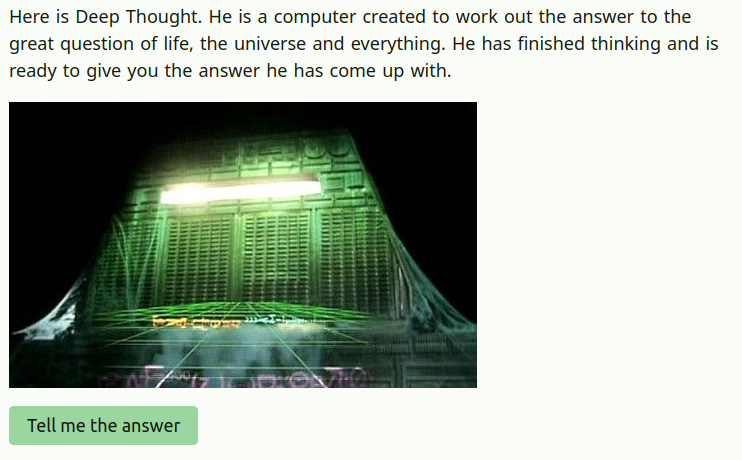

# The Answer

An animation of the answer (and the question) from The Hitchhiker's Guide to the Galaxy

## Table of contents

- [General info](#general-info)
- [Screenshots](#screenshots)
- [Technologies](#technologies)
- [Setup](#setup)
- [Status](#status)

## General info

I wanted to do something where everything on the page changes when you click a button. That's easy to do in React etc, but I wanted to see how to get it to work in vanilla JavaScript.

## Screenshots



## Technologies

- SCSS
- JavaScript
- Vite

## Setup

To view this project visit the [demo](https://the-answer.pages.dev/) or download the files, open a terminal in that folder and install locally using npm:

```
npm install
```

Then run the app locally:

```
npm run dev
```

## Status

Project is: _finished_
